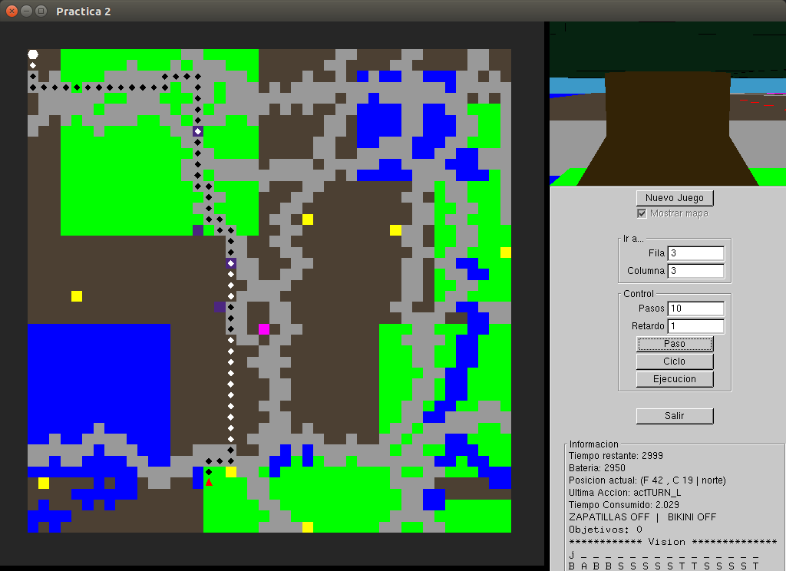

# Práctica 2: Los extraños mundos de Belkan

> Por: Mapachana

## Introducción

En este documento se explicarán los algoritmos implementados para el nivel 1 y nivel 2, así como todas las funciones auxiliares utilizadas para su correcto funcionamiento.

## Búsqueda en profundidad

Para la búsqueda en Profundidad, el algoritmo ya estaba implementado, por lo que fue suficiente seguir el tutorial de la práctica para comprender el funcionamiento de la misma.

Tras completar el tutorial, el método `think` sirvió para todo el Nivel 1, solo teniendo que realizar cambios para el nivel 2.

## Búsqueda en anchura

Para implementar este método ha bastado usar una cola en lugar de una pila para almacenar los nodos aún sin visitar, siguiendo un algoritmo análogo al de la búsqueda en profundidad. De esta manera, los nodos se recorren por niveles de una manera sencilla.

## Costo Uniforme

### Funciones auxiliares

Para implementar el costo uniforme vamos a utilizar una cola con prioridad para almacenar los posibles nodos a visitar. Por tanto, necesitamos implementar un método para ordenarlos, en función de un atributo `coste` que he añadido al nodo, para almacenar el costo total de llegar hasta él.

Al declarar la cola con prioridad indicando que se ordene de esta forma, esta queda ordenada de menor a mayor coste, así, el siguiente nodo a explorar será el primero de la cola.

Además, añado dos métodos para calcular el coste de un nodo en función del tipo que sea, por ejemplo: bosque, agua, etc y de los objetos que se hayan encontrado.

```cpp
int ComportamientoJugador::calcular_costo(estado est, bool zap, bool bik);
int ComportamientoJugador::costo_bateria(char tipo, bool zap, bool bik);
```

Así mismo, al tipo `nodo` se le han añadido unos atributos `zapatillas` y `bikini` para indicar si antes de llegar a ese nodo han pasado por alguna casilla obteniendo así el objeto correspondiente. Esto es, si en el camino que los ha llevado a ese nodo han obtenido, o no, un objeto, y así contemplarlo en el cálculo del coste de dicho nodo. En consecuencia, se ha implementado este método para actualizar si encontramos o no un objeto en la casilla actual y tenerlo en cuenta en los nodos que se visiten posteriormente.

```cpp
void ComportamientoJugador::actualizarBikiniZapatillas(nodo & n);
```

### Algoritmo

Así, el método para calcular la ruta de mínimo costo usando coste uniforme sería introducir el nodo origen para explorarlo (indicando coste 0 y que no tenemos ningún objeto al inicio), ir generando los hijos calculando su coste y actualizando los objetos de cada nodo y añadirlos a la cola con prioridad de nodos a expandir. Para obtener el siguiente nodo a explorar bastaría coger el primer nodo de la cola con prioridad, pues están ordenados de menor a mayor coste.

Para la implementación de este algoritmo se ha considerado realizar el camino de mínimo gasto de batería, es decir, no se han considerado las recargas para calcular la ruta óptima que se pide.

### Ejemplo



## Nivel 2

### Funciones auxiliares

Para el nivel 2 primero he implementado una función que vaya actualizando el mapa a medida que es descubierto usando para ello los sensores.

```cpp
void ComportamientoJugador::actualizar_mapa(Sensores sensores);
```

Además, como heurística se ha intentado corregir ligeramente los caminos con la distancia de Manhattan, cuya importancia al decidir el camino dependerá del tamaño del mapa:

```cpp
int distManhattan(estado est1, estado est2){
	return abs(est1.fila-est2.fila) + abs(est1.columna-est2.columna);
}
```

### Algoritmo

También se ha añadido un atributo al jugador por cada objeto (`zapatillas` y `bikini`), pues una vez conseguido, se mantendrá para futuros objetivos, independientemente de que para conseguir estos se haya pasado o no por un objeto en el camino al nuevo objetivo generado.

Ha sido necesario, además, añadir un atributo `heuristica` a la clase `nodo` para poder almacenar el valor total de considerar el costo y la heurística.

Al querer ordenar entonces la cola con prioridad por el valor de `heuristica` creamos una nueva función de ordenación para los nodos, en la que primero se ordenará en función del valor de la heurística y luego del coste.

Por tanto, el método para calcular la ruta del nivel 2 sería análogo al de costo uniforme, pero sumando al coste normal el valor de la heurística, que es la distancia de Manhattan y almacenándolo en el atributo `heuristica` correspondiente a cada nodo, por el cual se ordena la cola con prioridad. Para escoger el siguiente nodo a 

Además se ha de tener en cuenta que una vez obtenido un objeto, se mantiene para los posteriores, así que se almacenará en un atributo del Jugador.

### Método think

Se ha modificado el método `think` solamente para el nivel 4, para poder implementar los comportamientos que se piden, para ello:

- Si no se tiene un plan se calculará la ruta al objetivo.
- Si se tiene delante un obstáculo, se recalculará el plan con la nueva información.
- Si en la casilla siguiente hay un aldeano, esperaremos a que se vaya.
- Si queda poca batería, mucho tiempo y pasamos por una casilla de recarga nos paramos a recargar.
- Si obtenemos un objeto, se debe almacenar de forma permanente en el jugador con los atributos definidos para ello.
- Si pasamos por una casilla de recarga, con más de un tercio del tiempo disponible y tenemos menos de la mitad de la batería, nos quedaremos recargando (actIDLE) hasta que quede menos de un tercio del tiempo o tengamos disponible más de la mitad de la batería.

Además, al principio de la ejecución, cada ciertos pasos (determinados por `pasos` y un contador `par`) asumimos que hemos descubierto nuevas zonas del mapa, por lo que recalculamos el camino usando la nueva información.

```cpp
Action ComportamientoJugador::think(Sensores sensores) {
	static int par = 0;
	Action accion = actIDLE;
	estado copia;

	if (sensores.nivel != 4){
		if (!hayPlan){
			actual.fila = sensores.posF;
			actual.columna = sensores.posC;
			actual.orientacion = sensores.sentido;
			destino.fila = sensores.destinoF;
			destino.columna= sensores.destinoC;
			hayPlan = pathFinding(sensores.nivel, actual, destino, plan);
		}
		Action sigAction;
		if (hayPlan and plan.size()>0){
			sigAction = plan.front();
			plan.erase(plan.begin());
		}
		else{}
		return sigAction;
	}
	else{
		actual.fila = sensores.posF;
		actual.columna = sensores.posC;
		actual.orientacion = sensores.sentido;
		destino.fila = sensores.destinoF;
		destino.columna= sensores.destinoC;

		tiempo--;
		actualizar_mapa(sensores);

		if (sensores.bateria <= 100){
			par = -1;
		}

		int pasos = 7;
		if (par % pasos == 0 and par <= mapaResultado[1].size()*10)
			hayPlan = pathFinding(sensores.nivel, actual, destino, plan);
		++par;		
			
		copia = actual;

		if(actual.fila == destino.fila and actual.columna == destino.columna)
			hayPlan = false;

		if (mapaResultado[actual.fila][actual.columna] == 'D')
			zapatillas = true;
		else if (mapaResultado[actual.fila][actual.columna] == 'K')
			bikini = true;

		Action sigAction;
		if (hayPlan and plan.size()>0){
			if (HayObstaculoDelante(copia) and plan.front() == actFORWARD){
				hayPlan = pathFinding (sensores.nivel, actual, destino, plan);
			}
			if (sensores.superficie[2] == 'a' and plan.front() == actFORWARD){
				sigAction = actIDLE;
			}
			else if (mapaResultado[actual.fila][actual.columna] == 'X' and tiempo > tiempo_mapa/3 and (sensores.bateria < tiempo_mapa/2)){
				sigAction = actIDLE;
			}
			else{
				sigAction = plan.front();
				plan.erase(plan.begin());
			}	
		}
		else{
			hayPlan = pathFinding(sensores.nivel, actual, destino, plan);
		}
		return sigAction;
	}
  }
```

